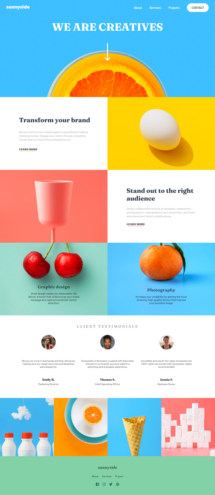
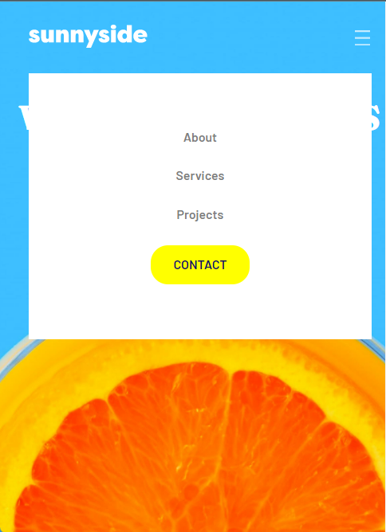

# Frontend Mentor - Sunnyside agency landing page solution

 
    
    
    

- [Overview](#overview)
  - [The challenge](#the-challenge)
  - [Built with](#built-with)
  
## Overview

### The challenge

Users should be able to:

- View the optimal layout for the site depending on their device's screen size
- See hover states for all interactive elements on the page

### Built with

- Semantic HTML5 markup
- CSS custom properties
- Flexbox
- CSS Grid
- Mobile-first workflow
- [React](https://reactjs.org/) - JS library